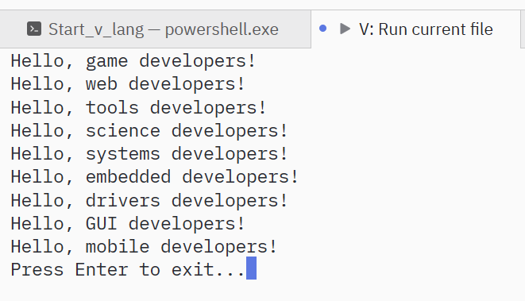
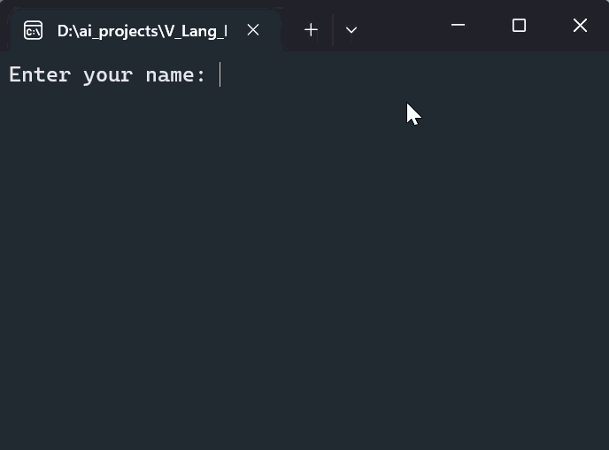

## Started to learn V language

V, also known as vlang, is an in-development statically typed, compiled programming language created by Alexander Medvednikov in early 2019.It was inspired by Go, and other programming languages including Oberon, Swift, and Rust. It is free and open-source software released under the MIT License, and currently **in beta**.

```
fn main() {
	println("Hello, World!")
}
```

# Day 1

Install 
[V language](https://vlang.io/)

Editor
[Zed editor](https://zed.dev/download)

My first programm

# Day 3

Documentation

ChatGPT


